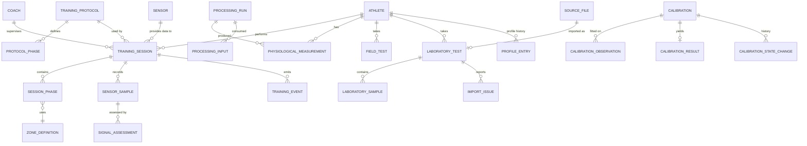

# Data Model — Interval Assistance

**Status:** DRAFT conceptual model derived from `MASTER_PROMPT.md` (V2). This is a logical design, not a DDL. Column lists are illustrative of required information, not final schemas. No database exists yet.

**Labels:** MANDATED (Master Prompt), PROPOSED (needs approval), OPEN (unresolved).

---

## 1. Design principles

1. **Normalized relational model** in PostgreSQL (SQLite for development), SQLAlchemy 2.x, Alembic migrations (MANDATED).
2. **Every table must justify its existence.** The Master Prompt lists candidate entities but says not to blindly create all of them. Section 3 marks each as *core*, *deferred*, or *merged*.
3. **Raw data is append-only** (MANDATED): raw sensor samples, original lab files, raw field-test inputs. No UPDATE or DELETE paths in application code for these tables (enforcement by repository design and, where supported, database permissions).
4. **No untyped values.** Every physiological value row carries `value_kind`, `unit`, and a provenance reference (MANDATED, Section 3).
5. **Reproducibility.** Derived values are stored together with the method id/version and the inputs used, so they can be recomputed from raw data.
6. **Versioned methods.** Protocols, formulas, calibrations, import mappings and processing logic are versioned; historical rows keep the version used (MANDATED).
7. **Pseudonymity.** Athlete records use pseudonymous identifiers; direct identifiers live in a separate, access-controlled table or are omitted (MANDATED principle, PROPOSED structure).
8. **Time.** All wall-clock timestamps are stored in UTC. Monotonic elapsed time is stored separately where the session clock applies. Device, ingestion, event and elapsed times are distinct columns, never merged (MANDATED).
9. **Synthetic data is labelled.** Rows that originate from the simulator or synthetic fixtures carry `is_synthetic = true` and a source kind; synthetic rows must never be exportable as real athlete data without that label.

---

## 2. Value kinds and provenance

### 2.1 `value_kind` (enumeration)

`raw | measured | estimated | calculated | calibrated | personalized`

`raw` is used for unmodified imported/received data. The remaining five are the Master Prompt's distinctions. (No `predicted` kind exists now; see `FUTURE_ML.md`.)

### 2.2 `ProcessingRun` / provenance record (PROPOSED, core)

One row per execution of a method that produces derived values.

| Field | Purpose |
|---|---|
| id | identity |
| method_id, method_version | what produced the value (e.g. a target calculation, an analytics metric, a calibration fit) |
| software_version | application version at execution |
| parameters | the exact parameter set used (thresholds, mappings), stored as structured data |
| created_at (UTC), actor | system or user |
| is_synthetic | whether any input was synthetic |

Input linkage: `ProcessingInput(processing_run_id, input_table, input_id, role)` records which rows were consumed. This answers "where did this value come from?" (MANDATED, Section 23).

### 2.3 `PhysiologicalMeasurement` (PROPOSED, core)

The common typed container for scalar physiological values that are not high-volume streams (streams use `SensorSample` and the laboratory sample tables).

| Field | Purpose |
|---|---|
| id, athlete_id | owner |
| quantity | enumerated name (e.g. `hr_rest`, `hr_max`, `vo2max`, `target_hr`, `time_in_target`) |
| value_kind | see 2.1 |
| value, unit | numeric value and normalized unit; nullable when `availability != available` |
| availability | `available | unavailable` with `unavailable_reason` code (MANDATED: metrics state when unavailable) |
| origin | quantity-specific origin category, e.g. for HRmax: `measured_in_test | observed_in_session | entered_by_coach | predicted_by_formula` |
| context | optional structured context (e.g. exercise type, posture, test id) |
| valid_from / valid_to, superseded_by | validity window; later values supersede, never overwrite |
| processing_run_id | provenance (required unless kind = `raw`/entered, in which case `entered_by` and source reference are required) |

Rule: a calibrated VO₂max and the uncalibrated estimate it came from are **two rows** linked through provenance, not one row updated (MANDATED, Section 29).

---

## 3. Entity inventory

Candidate entities from the Master Prompt (Section 33), with disposition.

| Entity | Disposition | Reason / notes |
|---|---|---|
| Athlete | **core** | Pseudonymous id; optional link to separate identity record. |
| Coach | **core** | Owner of protocols/sessions; access control. |
| Sensor | **core** | Device registry (type, adapter kind, identifier). |
| SensorSample | **core (raw)** | Append-only raw HR samples. |
| TrainingProtocol | **core** | Versioned definition. |
| Interval | **merged** into TrainingPhase / protocol structure | An interval is a work+recovery pair; modelled as ordered phases with an interval index rather than a separate table. |
| TrainingPhase | **core** | Planned phases (in protocol) and actual phase records (in session). |
| ZoneDefinition | **core** | Target, lower, upper, origin, tolerance, override info. |
| TrainingSession | **core** | A run of a protocol by an athlete with a sensor. |
| SignalQuality | **core** (as `SignalAssessment`) | Per-sample quality state and reasons. |
| TrainingEvent | **core** | Domain events (append-only). |
| PhysiologicalMeasurement | **core** | Section 2.3. |
| SessionSummary | **merged** | Summary metrics are `PhysiologicalMeasurement` rows tied to a session via a `SessionMetricSet` grouping (deferred if a plain query suffices). |
| FieldTest | **deferred (Phase 7)** | |
| FieldTestResult | **deferred (Phase 7)** | Stored as measurements of kind `estimated`. |
| LaboratoryTest | **deferred (Phase 8)** | |
| Calibration | **deferred (Phase 9)** | |
| CalibrationResult | **deferred (Phase 9)** | |
| PersonalProfile | **deferred (Phase 10)** | Realized as a history of profile entries (Section 7), not one mutable row. |

Supporting entities (PROPOSED): `ProcessingRun`, `ProcessingInput`, `SourceFile`, `ImportMapping`, `ImportIssue`, `CalibrationStateChange`, `ZoneOverride`, `AuditLog`.

---

## 4. Real-time training entities

### 4.1 Athlete, Coach, Sensor

- `Athlete(id, pseudonym, created_at, coach_id?, …)`. Direct identifiers (name, date of birth, contact) are kept out of this table. (PROPOSED: `AthleteIdentity` table with restricted access, or not stored at all.) OPEN: which attributes (body mass, sex, age, training status) are collected, and for which methods they are needed (minimum necessary data).
- `Coach(id, pseudonym or account reference, …)`. Authentication design is OPEN.
- `Sensor(id, kind [polar_h10 | generic_ble_hr | simulator | manual | replay], external_identifier?, …)`.

### 4.2 TrainingProtocol (versioned, PROPOSED)

`TrainingProtocol(id, name, version, created_by, created_at, …)` with structured phase plan:

`ProtocolPhase(protocol_id, sequence, phase_type [warmup | work | recovery | cooldown], interval_index?, duration_seconds, zone_spec)`

`zone_spec` captures the intensity mode (absolute, %HRmax, %HRR, %VO₂max approximation, personalized, manual), its parameters, and tolerance. Also at protocol level: completion condition (interval count | total duration | explicit), audio settings, warning settings, exercise type.

A protocol version is immutable once used by a session; edits create a new version.

### 4.3 ZoneDefinition and ZoneOverride

`ZoneDefinition(id, origin_mode, target_bpm, lower_bpm, upper_bpm, tolerance_spec, resolved_from_inputs, processing_run_id)` records the *resolved* zone for a phase of a session (what the engine actually used), including the inputs (HRmax/HRrest values and their origins).

`ZoneOverride(id, athlete_or_session_scope, previous_zone, new_zone, actor, reason, created_at)` makes overrides auditable (MANDATED).

### 4.4 TrainingSession

`TrainingSession(id, athlete_id, coach_id, protocol_id + version, sensor_id, status, started_at, ended_at, end_reason [completed | stopped_early | error], is_synthetic, engine_version, parameters_snapshot)`

`parameters_snapshot` stores the debounce/threshold configuration in force (so the session remains interpretable if defaults change later). Also records session-level HRmax/HRrest values and their origins at start.

### 4.5 SessionPhase (actual)

`SessionPhase(session_id, sequence, phase_type, interval_index, planned_duration, started_elapsed, ended_elapsed, started_at, ended_at, resolved_zone_id)`: planned vs. actual stored side by side so summaries can separate **planned / observed / calculated** (MANDATED).

### 4.6 SensorSample (raw, append-only)

| Field | Purpose |
|---|---|
| id, session_id, sensor_id | identity |
| sequence | per-session arrival order |
| received_hr | value exactly as received (nullable if malformed) |
| raw_payload | original bytes/text where available |
| device_timestamp | nullable |
| ingestion_timestamp (UTC) | |
| elapsed_seconds | monotonic session-clock time at ingestion |
| source_kind | `real | simulated | replay | manual` |
| is_synthetic | |

Never updated. Additional fields from sensors (for example beat-to-beat interval data) are **not assumed**; the table can be extended once an adapter's actual outputs are verified (OPEN, Polar H10 unverified).

Volume note: roughly one row per sensor update per session; time-series partitioning is not needed at research scale (PROPOSED: revisit if data volume demands).

### 4.7 SignalAssessment and corrections

`SignalAssessment(sample_id, quality_state [UNKNOWN|GOOD|ACCEPTABLE|POOR|INVALID|STALE|MISSING], reasons[], processing_run_id)`: separate from the raw row so reprocessing with a new version adds assessments rather than editing samples.

`SampleCorrection(sample_id, original_value, corrected_value, method, reason, created_at, processing_version)`: exists only if corrections are permitted (OPEN, Scientific Specification Section 5; the default is flag-only).

Gaps and stale intervals are represented as assessment records over time ranges (`MISSING`/`STALE`), not as invented samples.

### 4.8 TrainingEvent (append-only)

`TrainingEvent(id, session_id, sequence, event_type, event_timestamp (UTC), elapsed_seconds, hr_bpm?, phase_type?, interval_index?, source [engine | sensor | user | system], metadata, engine_version)`

`event_type` values are those in Master Prompt Section 10. Events can recreate session state and drive replay and analytics.

---

## 5. Analytics storage

Session metrics are `PhysiologicalMeasurement` rows (kind `calculated`, linked to the session and, where phase-specific, to the phase) with a `ProcessingRun` recording the method version and the sample set used. Unavailable metrics are stored as rows with `availability = unavailable` and a reason, so a summary never silently omits or fabricates a value.

(PROPOSED) A `SessionMetricSet(session_id, processing_run_id, created_at)` groups a full summary computation so recomputation with a new method version adds a new set rather than replacing the old one.

---

## 6. Field-test entities (deferred)

- `FieldTestProtocol(id, name, version, source_reference_id, definition, status [EQUATION_NOT_SPECIFIED | APPROVED | RETIRED])`: descriptor fields per Scientific Specification Section 8.
- `FieldTest(id, athlete_id, protocol_id + version, performed_at, conditions, coach_id)`.
- `FieldTestInput(field_test_id, stage, input_name, value, unit)`: raw inputs, append-only.
- `FieldTestResult`: one or more `PhysiologicalMeasurement` rows (kind `estimated`, quantity `field_estimated_vo2max`) with provenance pointing at the inputs and protocol version. A result cannot be created while the protocol status is `EQUATION_NOT_SPECIFIED`.
- `SourceReference(id, citation, …)`: the approved reference register (empty at present).

---

## 7. Laboratory / CPET entities (deferred)

- `SourceFile(id, original_filename, content_hash, size, stored_location, uploaded_at, uploaded_by, format)`: the unmodified original; never edited.
- `ImportMapping(id, version, column_mapping, unit_mapping, header_rules, created_by, created_at)`: versioned configuration.
- `LaboratoryTest(id, athlete_id, source_file_id, import_mapping_id + version, imported_at, processing_run_id, qc_status [pass | warning | error], laboratory_metadata, reported_conventions)`: `reported_conventions` holds averaging method, laboratory's VO₂max/VO₂peak labelling and criteria (recorded, not inferred).
- `LaboratorySample(laboratory_test_id, row_ref, elapsed_seconds, timestamp?, vo2, vco2, ve, hr, rer, speed, grade, workload, units…)`: parsed rows (kind `measured`), each traceable to file row and column. Normalized units stored with the original unit and conversion reference.
- `ImportIssue(laboratory_test_id, severity [warning | error], code, row_ref?, message)`: QC findings visible to users.
- `SynchronizationRecord(id, laboratory_test_id, session_id?, method [common_timestamps | session_start | manual_offset | event_markers], offset_seconds, offset_sign_convention, notes, created_by, created_at)`.

Laboratory-reported VO₂max appears as a `PhysiologicalMeasurement` (kind `measured`, quantity `laboratory_measured_vo2max`) referencing the laboratory test and its conventions.

---

## 8. Calibration entities (deferred)

- `Calibration(id, scope, athlete_id?, method_id, method_version, state [CANDIDATE | VALIDATED | ACTIVE | REJECTED | RETIRED], created_at, created_by, processing_run_id)`. Scope (per-athlete vs population-level) is OPEN (Scientific Specification 11.3).
- `CalibrationObservation(calibration_id, estimate_measurement_id, reference_measurement_id, included [bool], exclusion_reason?)`: pairs of an estimate and its laboratory reference, traceable to raw sources.
- `CalibrationResult(calibration_id, parameter_a, parameter_b, n_valid, missingness, pre_error_metrics, post_error_metrics, validation_status, validity_range, notes)`: metrics chosen per the (still unspecified) methodology. No confidence percentage field.
- `CalibrationStateChange(calibration_id, from_state, to_state, actor, reason, changed_at)`: full history (MANDATED: never destroy the previous active calibration).
- Constraint (PROPOSED): at most one `ACTIVE` calibration per scope, enforced with a partial unique index.

A calibrated value is a `PhysiologicalMeasurement` of kind `calibrated`, whose provenance names the calibration and the uncalibrated estimate row.

---

## 9. Personalization entities (deferred)

`ProfileEntry(id, athlete_id, field [hr_rest | hr_max | hr_at_vo2max | field_vo2max | lab_vo2max | calibrated_vo2max | recovery_metric | zone_set | …], measurement_id or zone_definition_id, source, timestamp, validity, method_id, method_version, status [current | superseded | invalid], superseded_by)`

The "PersonalProfile" is the set of current entries; history is the full set. No entry is overwritten. Coach-defined zones are profile entries with source `coach` and are auditable through `ZoneOverride`.

---

## 10. Cross-cutting tables

- `AuditLog(id, actor, action, entity_table, entity_id, timestamp, details)`: sensitive actions (export, activation, override, deletion requests, access to identity data).
- `ExportRecord` (OPEN, Phase 11): record of what was exported, by whom, with which provenance.

---

## 11. Relationship overview

---

## 12. Immutability and retention summary

| Data | Mutability |
|---|---|
| SensorSample, SourceFile, LaboratorySample, FieldTestInput, TrainingEvent | append-only, never edited |
| SignalAssessment, ProcessingRun, SessionMetricSet | append-only; reprocessing adds new rows |
| PhysiologicalMeasurement | not edited; superseded via `superseded_by` / validity window |
| Calibration | state changes only through logged transitions; parameters immutable once created |
| TrainingProtocol, FieldTestProtocol, ImportMapping | immutable per version |
| ProfileEntry | superseded, never overwritten |

Retention and deletion: athlete data-deletion and export obligations depend on jurisdiction (UNKNOWN) and may conflict with append-only rules; a policy (for example pseudonym unlinking or tombstoning) must be defined in Phase 12. OPEN.

---

## 13. Open questions

1. Attributes collected for athletes (body mass, age, sex, training status) and where each is needed.
2. Calibration scope and unit of observation (Scientific Specification 11.3).
3. Whether corrections to samples are permitted at all (`SampleCorrection` exists only if so).
4. Primary key strategy (PROPOSED: UUIDs for externally visible ids; pseudonymous athlete ids not derived from identity).
5. SQLite development parity with PostgreSQL features used (partial unique indexes, JSON types).
6. Authentication/authorization model and the coach–athlete relationship (one coach per athlete vs many).
7. Data retention, deletion and export policy under the applicable jurisdiction.
8. Which beat-level data (if any) the verified sensor interface provides.
