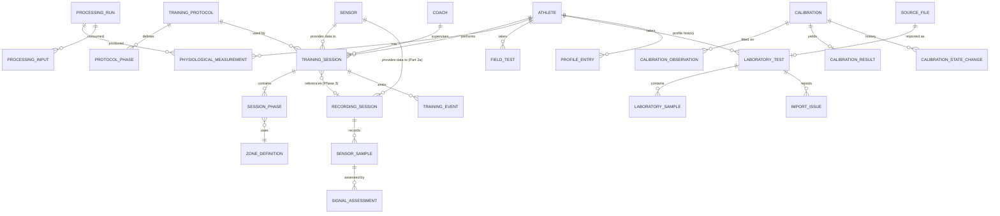

# Data Model — Interval Assistance

**Status:** DRAFT conceptual model derived from `MASTER_PROMPT.md` (V2). This is a logical design, not a DDL. Column lists are illustrative of required information, not final schemas. No database exists yet.

**Labels:** MANDATED (Master Prompt), PROPOSED (needs approval), OPEN (unresolved).

**Phase 1 scope (approved decision):** Phase 1 contains the SQLAlchemy 2.x and Alembic foundation with an **empty baseline migration** and no domain tables. In particular **no `SensorSample` table** (raw HR sample persistence is Phase 2). The normalized heart-rate sample is an in-memory type in Phase 1. SQLite is supported for development and CI; PostgreSQL remains the production target. **UUID is the approved identifier strategy.** The entity descriptions below are the target design for later phases. See `SPECIFICATION_REVIEW.md`.

**Part 2a scope (decided in `SPECIFICATION_REVIEW.md` Section 12):** Part 2a creates exactly these tables: `sensor`, `recording_session`, `sensor_sample`, `processing_run`, `signal_assessment` (Sections 4.4a, 4.6, 4.7, 2.2). It does **not** create `Athlete`, `Coach`, `TrainingProtocol`, `ProtocolPhase`, `ZoneDefinition`, `TrainingSession`, `SessionPhase`, `TrainingEvent`, `PhysiologicalMeasurement`, `ProcessingInput`, `SampleCorrection`, `AuditLog` or any field-test, laboratory, calibration or profile table. The API is unchanged in Part 2a.

---

## 1. Design principles

1. **Normalized relational model** in PostgreSQL (SQLite for development), SQLAlchemy 2.x, Alembic migrations (MANDATED).
2. **Every table must justify its existence.** The Master Prompt lists candidate entities but says not to blindly create all of them. Section 3 marks each as *core*, *deferred*, or *merged*.
3. **Raw data is append-only** (MANDATED): raw sensor samples, original lab files, raw field-test inputs. No UPDATE or DELETE paths in application code for these tables (enforcement by repository design and, where supported, database permissions).
4. **No untyped values.** Every physiological value row carries `value_kind`, `unit`, and a provenance reference (MANDATED, Section 3).
5. **Reproducibility.** Derived values are stored together with the method id/version and the inputs used, so they can be recomputed from raw data.
6. **Versioned methods.** Protocols, formulas, calibrations, import mappings and processing logic are versioned; historical rows keep the version used (MANDATED).
7. **Pseudonymity.** Athlete records use pseudonymous identifiers; direct identifiers live in a separate, access-controlled table or are omitted (MANDATED principle, PROPOSED structure).
8. **Time.** All wall-clock timestamps are stored in UTC. Monotonic elapsed time is stored separately where the session clock applies. Device, ingestion, event and elapsed times are distinct columns, never merged (MANDATED).
9. **Synthetic data is labelled.** Rows that originate from the simulator or synthetic fixtures carry `is_synthetic = true` and a source kind; synthetic rows must never be exportable as real athlete data without that label.

---

## 2. Value kinds and provenance

### 2.1 `value_kind` (enumeration)

`raw | measured | estimated | calculated | calibrated | personalized`

`raw` is used for unmodified imported/received data. The remaining five are the Master Prompt's distinctions. (No `predicted` kind exists now; see `FUTURE_ML.md`.)

### 2.2 `ProcessingRun` / provenance record (PROPOSED, core; **promoted to required for Part 2a**)

**Decision (Part 2a):** `ProcessingRun` becomes a required table in Part 2a because every `SignalAssessment` is a derived value and must carry method id, method version and parameters (MANDATED provenance). `ProcessingInput` is **not** created in Part 2a: assessments reference their input sample(s) directly (`signal_assessment.sample_id` or the range sample references) and the run references its `recording_session_id`, which is sufficient traceability until runs consume heterogeneous inputs. Two additions to the table below for Part 2a: `recording_session_id` (scope of the run) and `actor` = `system`.

One row per execution of a method that produces derived values.

| Field | Purpose |
|---|---|
| id | identity |
| method_id, method_version | what produced the value (e.g. a target calculation, an analytics metric, a calibration fit) |
| software_version | application version at execution |
| parameters | the exact parameter set used (thresholds, mappings), stored as structured data |
| created_at (UTC), actor | system or user |
| is_synthetic | whether any input was synthetic |

Input linkage: `ProcessingInput(processing_run_id, input_table, input_id, role)` records which rows were consumed. This answers "where did this value come from?" (MANDATED, Section 23).

**Part 2a lifecycle and ownership (decided).**

- **Creation.** Opening a recording session creates its one `ProcessingRun` in the same transaction as the `recording_session` row (method `signal_assessment`, the method version, and the signal-quality configuration snapshot as `parameters`). A session therefore never exists without its run.
- **Ownership.** Every `SignalAssessment` produced for that session belongs to this run: per-sample assessments, `gap` ranges written when the later sample arrives, and the close-time `stale` range. Each assessment's `recording_session_id` equals its run's.
- **Replay sessions** have their own run created when the replay session is opened; replay never copies or reuses the origin session's assessments.
- **Reassessment is deferred.** Part 2a provides no reassessment operation, so each recording session has exactly one run and "the run to use" is unambiguous. When reassessment is introduced it must create a *new* run with new assessments and never overwrite or delete historical ones; the selection rule in Section 4.7 then applies.
- **Unassessed samples.** A sample whose assessment was not committed (for example a failure between the raw commit and the assessment commit) has no assessment in the run. Consumers must treat "no assessment" as unassessed, never as `GOOD`. Part 2a does not repair this.

### 2.3 `PhysiologicalMeasurement` (PROPOSED, core)

The common typed container for scalar physiological values that are not high-volume streams (streams use `SensorSample` and the laboratory sample tables).

| Field | Purpose |
|---|---|
| id, athlete_id | owner |
| quantity | enumerated name (e.g. `hr_rest`, `hr_max`, `vo2max`, `target_hr`, `time_in_target`) |
| value_kind | see 2.1 |
| value, unit | numeric value and normalized unit; nullable when `availability != available` |
| availability | `available | unavailable` with `unavailable_reason` code (MANDATED: metrics state when unavailable) |
| origin | quantity-specific origin category, e.g. for HRmax: `measured_in_test | observed_in_session | entered_by_coach | predicted_by_formula` |
| context | optional structured context (e.g. exercise type, posture, test id) |
| valid_from / valid_to, superseded_by | validity window; later values supersede, never overwrite |
| processing_run_id | provenance (required unless kind = `raw`/entered, in which case `entered_by` and source reference are required) |

Rule: a calibrated VO₂max and the uncalibrated estimate it came from are **two rows** linked through provenance, not one row updated (MANDATED, Section 29).

---

## 3. Entity inventory

Candidate entities from the Master Prompt (Section 33), with disposition.

| Entity | Disposition | Reason / notes |
|---|---|---|
| Athlete | **core** | Pseudonymous id; optional link to separate identity record. |
| Coach | **core** | Owner of protocols/sessions; access control. |
| Sensor | **core, Part 2a** | Device registry (kind, identifier). Part 2a kinds: `simulator`, `manual`, `replay`. |
| RecordingSession | **core, Part 2a (new)** | Container for one continuous collection of samples; independent of protocols/training (Section 4.4a). |
| SensorSample | **core (raw), Part 2a** | Append-only raw HR samples. Not created in Phase 1. |
| ProcessingRun | **core, Part 2a (promoted)** | Provenance of derived values (Section 2.2). |
| TrainingProtocol | **core** | Versioned definition. |
| Interval | **merged** into TrainingPhase / protocol structure | An interval is a work+recovery pair; modelled as ordered phases with an interval index rather than a separate table. |
| TrainingPhase | **core** | Planned phases (in protocol) and actual phase records (in session). |
| ZoneDefinition | **core** | Target, lower, upper, origin, tolerance, override info. |
| TrainingSession | **core** | A run of a protocol by an athlete with a sensor. |
| SignalQuality | **core, Part 2a** (as `SignalAssessment`) | Per-sample and per-range quality state and reasons. |
| TrainingEvent | **core** | Domain events (append-only). |
| PhysiologicalMeasurement | **core** | Section 2.3. |
| SessionSummary | **merged** | Summary metrics are `PhysiologicalMeasurement` rows tied to a session via a `SessionMetricSet` grouping (deferred if a plain query suffices). |
| FieldTest | **deferred (Phase 7)** | |
| FieldTestResult | **deferred (Phase 7)** | Stored as measurements of kind `estimated`. |
| LaboratoryTest | **deferred (Phase 8)** | |
| Calibration | **deferred (Phase 9)** | |
| CalibrationResult | **deferred (Phase 9)** | |
| PersonalProfile | **deferred (Phase 10)** | Realized as a history of profile entries (Section 7), not one mutable row. |

Supporting entities (PROPOSED): `ProcessingRun`, `ProcessingInput`, `SourceFile`, `ImportMapping`, `ImportIssue`, `CalibrationStateChange`, `ZoneOverride`, `AuditLog`.

---

## 4. Real-time training entities

### 4.1 Athlete, Coach, Sensor

- `Athlete(id, pseudonym, created_at, coach_id?, …)`. Direct identifiers (name, date of birth, contact) are kept out of this table. (PROPOSED: `AthleteIdentity` table with restricted access, or not stored at all.) OPEN: which attributes (body mass, sex, age, training status) are collected, and for which methods they are needed (minimum necessary data).
- `Coach(id, pseudonym or account reference, …)`. Authentication design is OPEN.
- `Sensor(id, kind [polar_h10 | generic_ble_hr | simulator | manual | replay], external_identifier?, …)`.

### 4.2 TrainingProtocol (versioned, PROPOSED)

`TrainingProtocol(id, name, version, created_by, created_at, …)` with structured phase plan:

`ProtocolPhase(protocol_id, sequence, phase_type [warmup | work | recovery | cooldown], interval_index?, duration_seconds, zone_spec)`

`zone_spec` captures the intensity mode (absolute, %HRmax, %HRR, %VO₂max approximation, personalized, manual), its parameters, and tolerance. Also at protocol level: completion condition (interval count | total duration | explicit), audio settings, warning settings, exercise type.

A protocol version is immutable once used by a session; edits create a new version.

### 4.3 ZoneDefinition and ZoneOverride

`ZoneDefinition(id, origin_mode, target_bpm, lower_bpm, upper_bpm, tolerance_spec, resolved_from_inputs, processing_run_id)` records the *resolved* zone for a phase of a session (what the engine actually used), including the inputs (HRmax/HRrest values and their origins).

`ZoneOverride(id, athlete_or_session_scope, previous_zone, new_zone, actor, reason, created_at)` makes overrides auditable (MANDATED).

### 4.4 TrainingSession

`TrainingSession(id, athlete_id, coach_id, protocol_id + version, sensor_id, status, started_at, ended_at, end_reason [completed | stopped_early | error], is_synthetic, engine_version, parameters_snapshot)`

`parameters_snapshot` stores the debounce/threshold configuration in force (so the session remains interpretable if defaults change later). Also records session-level HRmax/HRrest values and their origins at start.

### 4.5 SessionPhase (actual)

`SessionPhase(session_id, sequence, phase_type, interval_index, planned_duration, started_elapsed, ended_elapsed, started_at, ended_at, resolved_zone_id)`: planned vs. actual stored side by side so summaries can separate **planned / observed / calculated** (MANDATED).

### 4.4a RecordingSession (Part 2a, decided)

A `RecordingSession` is the minimal container for samples collected from one sensor in one continuous run. It has **no** athlete, coach, protocol, phase, interval, zone or workout semantics; those belong to `TrainingSession` (Phase 3), which will later *reference* a recording session. Part 2a samples never reference a `TrainingSession`.

`RecordingSession(id, sensor_id, source_kind, is_synthetic, started_at, ended_at?, end_reason? [completed | interrupted], signal_quality_config_id, signal_quality_config_version, signal_quality_config_hash, origin_recording_session_id?)`

- `source_kind` and `is_synthetic` equal those of every sample in the session (enforced at ingestion); a session has exactly one source kind.
- `started_at` is the injected `Clock` UTC time at creation. The monotonic origin used for `elapsed_seconds` exists only in the process that created the session, so **a recording session cannot be resumed after a process restart**. A session whose process is gone can only be closed (`end_reason = interrupted`); further data requires a new session.
- `signal_quality_config_*` record the exact configuration in force (Scientific Specification 5.1), so the session remains interpretable if configuration changes later.
- `origin_recording_session_id` is set only for replay sessions (Section 4.6a).
- Closed sessions accept no further samples.

`Sensor(id, kind, external_identifier?, created_at)`: `kind` in Part 2a is constrained to `simulator | manual | replay`; `polar_h10` and `generic_ble_hr` are added by the Part 2b migration. `external_identifier` is not interpreted in Part 2a.

### 4.6 SensorSample (raw, append-only), Part 2a (decided mapping)

Not implemented in Phase 1. The table is the persisted form of the in-memory sample (`ARCHITECTURE.md` 7.1, amended). **No information is discarded, with one documented exception:** a naive `device_timestamp` delivered without a `raw_payload` is stored as NULL and its original value is lost (see the `device_timestamp` row, `ARCHITECTURE.md` 5.1a, and the OPEN item in `SPECIFICATION_REVIEW.md` 12.2). Mapping:

| Column | Source | Notes |
|---|---|---|
| id | `IdGenerator` | UUID |
| recording_session_id | ingestion | FK. The sample's `sensor_id` must equal the session's sensor (else `InvalidSensorSample`); the sensor is reached through the session, so it is not repeated here |
| sequence | ingestion | integer >= 1, strictly increasing and gap-free per session in arrival order; unique with `recording_session_id` |
| received_hr | sample `received_hr` | float, **nullable**, beats per minute exactly as received; never rounded, clipped or repaired. Stores **finite values only** (see `received_hr_nonfinite`) |
| received_hr_nonfinite | derived from the sample value | text, nullable, one of `nan`, `+inf`, `-inf`. Set if and only if the received value is NaN, +Infinity or -Infinity; in that case `received_hr` is NULL. A check constraint enforces both directions (set implies `received_hr` NULL; a finite `received_hr` implies this column NULL) |
| raw_payload | sample `raw_payload` | bytes, nullable; original payload where the adapter has one |
| device_timestamp | sample `device_timestamp` | UTC, nullable; may be absent or unreliable. A timezone-aware value in any offset is normalized to UTC (instant preserved, offset not stored). A naive value is stored as NULL and flagged `invalid_timestamp`; it is preserved only if the adapter-supplied `raw_payload` carries it (ingestion never fabricates a payload), otherwise it is lost (`ARCHITECTURE.md` 5.1a; a dedicated column is OPEN for owner approval) |
| received_at | sample `received_at` | UTC, not null; adapter-observed receive time (the Phase 1 field). Always timezone-aware by the sample-type invariant; any offset is normalized to UTC, instant preserved |
| ingestion_timestamp | injected `Clock.now_utc()` at persistence | UTC, not null; distinct from `received_at` |
| elapsed_seconds | injected `Clock.monotonic()` minus the session's monotonic origin | float >= 0, not null; elapsed since the *recording* session started. It is not an interval/phase clock and has no pause semantics (Phase 3 defines the training-session clock) |
| source_kind | sample | `real | simulated | replay | manual`; equals the session's |
| is_synthetic | sample | must be true for `simulated` and `manual`; for `replay` it is inherited from the replayed sample |
| adapter_quality_hint | sample `quality_hint` | text, nullable; stored verbatim, **never interpreted** or mapped to a quality state in Part 2a |
| origin_sample_id | replay only | nullable self-FK to the replayed sample |

**Non-finite values (decided).** SQLite stores NaN as NULL and database float handling of NaN and infinities differs between backends, so Part 2a does not rely on the backend's float semantics. Ingestion records the *class* of a non-finite value in `received_hr_nonfinite` and leaves `received_hr` NULL. The class is recovered exactly (`nan`, `+inf`, `-inf`); a NaN's sign bit and payload bits are not preserved (they carry no meaning for heart rate and the raw payload, if the adapter had one, is retained in `raw_payload`). The in-memory sample is reconstructed from the stored class, so replay reproduces the original non-finite value. Such a sample is validated as `malformed_sample` and assessed `INVALID` like any non-numeric value. A non-finite value is never converted to a finite one, clipped or dropped.

Four time notions stay distinct (`ARCHITECTURE.md` 6): device timestamp, ingestion timestamp (plus the adapter `received_at`), event timestamp (not used in Part 2a) and monotonic elapsed time.

Never updated or deleted by application code: repositories expose no update or delete for this table, and a test enforces it. Database-level enforcement (triggers or permissions) remains OPEN. Additional sensor fields (for example beat-to-beat interval data) are **not assumed**; the table can be extended once an adapter's real outputs are verified (OPEN, Polar H10 unverified).

Volume note: roughly one row per sensor update per session; time-series partitioning is not needed at research scale (PROPOSED: revisit if data volume demands).

### 4.6a Replay provenance (Part 2a, decided)

Replay reads the stored samples of an *origin* recording session in `sequence` order and ingests them as a **new** recording session (`source_kind = replay`, `origin_recording_session_id` = origin). The origin session and its samples are never modified. Replay is an ingestion-layer service, not a `HeartRateSensor` adapter (`ARCHITECTURE.md` 7.2). Its recording session references a `sensor` row of kind `replay` (a registry entry representing the replay service, created on first use), not the origin's sensor; the origin's sensor is reachable through `origin_recording_session_id`. Each replayed sample copies `received_hr` (including `received_hr_nonfinite`), `raw_payload`, `device_timestamp`, `received_at` and `adapter_quality_hint` unchanged, gets a new `sequence`, `ingestion_timestamp` and `elapsed_seconds` from the replay session's clock, and sets `origin_sample_id`. The original `source_kind` is therefore recoverable through `origin_sample_id`. `is_synthetic` is inherited from the origin sample.

### 4.7 SignalAssessment (Part 2a) and corrections

`SignalAssessment(id, recording_session_id, sample_id?, range_start_at?, range_end_at?, after_sample_id?, before_sample_id?, quality_state [UNKNOWN|GOOD|ACCEPTABLE|POOR|INVALID|STALE|MISSING], reasons (JSON list of reason codes), processing_run_id, created_at)`

- Either **per-sample** (`sample_id` set, range fields null) or **range** (`sample_id` null; `range_start_at`, `range_end_at` and `after_sample_id` set; `before_sample_id` null for an open-ended range). Exactly one form per row (check constraint). A run has **at most one per-sample assessment per sample**: a unique constraint on `(processing_run_id, sample_id)`. Range rows have a NULL `sample_id`. A unique constraint treats NULLs as distinct, so **multiple range rows with a NULL `sample_id` in the same run are permitted**, and the constraint gives **no uniqueness guarantee for range rows**; it covers only per-sample rows, with no partial index. This is SQLite's documented behavior (verified on SQLite 3.50.4: duplicate non-NULL pairs are rejected, repeated `(run, NULL)` pairs are accepted) and PostgreSQL's default `NULLS DISTINCT` behavior (documented, not yet verified here); the PostgreSQL `NULLS NOT DISTINCT` option must not be used on this constraint. Range rows are not constrained by the schema in Part 2a: ingestion writes each `gap` once, when its later sample arrives, and the single `stale` range only at session close, which is write-once.
- Reason codes: `malformed_sample`, `missing`, `impossible_hr`, `invalid_timestamp` (validation) and `duplicate_timestamp`, `out_of_order_timestamp`, `implausible_jump`, `gap`, `stale` (signal quality). State rules are in `SCIENTIFIC_SPECIFICATION.md` 5.1.
- Separate from the raw row: reprocessing adds a new `processing_run` and new assessments; nothing is edited. Once reassessment exists (deferred; Section 2.2), the assessment to use for a sample is the one from the most recent `processing_run` for that sample; in Part 2a each session has exactly one run.
- `processing_run.method_id` is `signal_assessment` (validation then signal quality, as one versioned method); `method_version` is a string bumped on any rule change. `parameters` holds the configuration snapshot.

`SampleCorrection` is **not created in Part 2a**: no correction or interpolation is permitted; the policy is flag, do not repair (OPEN to revisit later, Scientific Specification Section 5).

Gaps and stale intervals are range assessments, not invented samples.

### 4.8 TrainingEvent (append-only)

`TrainingEvent(id, session_id, sequence, event_type, event_timestamp (UTC), elapsed_seconds, hr_bpm?, phase_type?, interval_index?, source [engine | sensor | user | system], metadata, engine_version)`

`event_type` values are those in Master Prompt Section 10. Events can recreate session state and drive replay and analytics.

---

## 5. Analytics storage

Session metrics are `PhysiologicalMeasurement` rows (kind `calculated`, linked to the session and, where phase-specific, to the phase) with a `ProcessingRun` recording the method version and the sample set used. Unavailable metrics are stored as rows with `availability = unavailable` and a reason, so a summary never silently omits or fabricates a value.

(PROPOSED) A `SessionMetricSet(session_id, processing_run_id, created_at)` groups a full summary computation so recomputation with a new method version adds a new set rather than replacing the old one.

---

## 6. Field-test entities (deferred)

- `FieldTestProtocol(id, name, version, source_reference_id, definition, status [EQUATION_NOT_SPECIFIED | APPROVED | RETIRED])`: descriptor fields per Scientific Specification Section 8.
- `FieldTest(id, athlete_id, protocol_id + version, performed_at, conditions, coach_id)`.
- `FieldTestInput(field_test_id, stage, input_name, value, unit)`: raw inputs, append-only.
- `FieldTestResult`: one or more `PhysiologicalMeasurement` rows (kind `estimated`, quantity `field_estimated_vo2max`) with provenance pointing at the inputs and protocol version. A result cannot be created while the protocol status is `EQUATION_NOT_SPECIFIED`.
- `SourceReference(id, citation, …)`: the approved reference register (empty at present).

---

## 7. Laboratory / CPET entities (deferred)

- `SourceFile(id, original_filename, content_hash, size, stored_location, uploaded_at, uploaded_by, format)`: the unmodified original; never edited.
- `ImportMapping(id, version, column_mapping, unit_mapping, header_rules, created_by, created_at)`: versioned configuration.
- `LaboratoryTest(id, athlete_id, source_file_id, import_mapping_id + version, imported_at, processing_run_id, qc_status [pass | warning | error], laboratory_metadata, reported_conventions)`: `reported_conventions` holds averaging method, laboratory's VO₂max/VO₂peak labelling and criteria (recorded, not inferred).
- `LaboratorySample(laboratory_test_id, row_ref, elapsed_seconds, timestamp?, vo2, vco2, ve, hr, rer, speed, grade, workload, units…)`: parsed rows (kind `measured`), each traceable to file row and column. Normalized units stored with the original unit and conversion reference.
- `ImportIssue(laboratory_test_id, severity [warning | error], code, row_ref?, message)`: QC findings visible to users.
- `SynchronizationRecord(id, laboratory_test_id, session_id?, method [common_timestamps | session_start | manual_offset | event_markers], offset_seconds, offset_sign_convention, notes, created_by, created_at)`.

Laboratory-reported VO₂max appears as a `PhysiologicalMeasurement` (kind `measured`, quantity `laboratory_measured_vo2max`) referencing the laboratory test and its conventions.

---

## 8. Calibration entities (deferred)

- `Calibration(id, scope, athlete_id?, method_id, method_version, state [CANDIDATE | VALIDATED | ACTIVE | REJECTED | RETIRED], created_at, created_by, processing_run_id)`. Scope (per-athlete vs population-level) is OPEN (Scientific Specification 11.3).
- `CalibrationObservation(calibration_id, estimate_measurement_id, reference_measurement_id, included [bool], exclusion_reason?)`: pairs of an estimate and its laboratory reference, traceable to raw sources.
- `CalibrationResult(calibration_id, parameter_a, parameter_b, n_valid, missingness, pre_error_metrics, post_error_metrics, validation_status, validity_range, notes)`: metrics chosen per the (still unspecified) methodology. No confidence percentage field.
- `CalibrationStateChange(calibration_id, from_state, to_state, actor, reason, changed_at)`: full history (MANDATED: never destroy the previous active calibration).
- Constraint (PROPOSED): at most one `ACTIVE` calibration per scope, enforced with a partial unique index.

A calibrated value is a `PhysiologicalMeasurement` of kind `calibrated`, whose provenance names the calibration and the uncalibrated estimate row.

---

## 9. Personalization entities (deferred)

`ProfileEntry(id, athlete_id, field [hr_rest | hr_max | hr_at_vo2max | field_vo2max | lab_vo2max | calibrated_vo2max | recovery_metric | zone_set | …], measurement_id or zone_definition_id, source, timestamp, validity, method_id, method_version, status [current | superseded | invalid], superseded_by)`

The "PersonalProfile" is the set of current entries; history is the full set. No entry is overwritten. Coach-defined zones are profile entries with source `coach` and are auditable through `ZoneOverride`.

---

## 10. Cross-cutting tables

- `AuditLog(id, actor, action, entity_table, entity_id, timestamp, details)`: sensitive actions (export, activation, override, deletion requests, access to identity data).
- `ExportRecord` (OPEN, Phase 11): record of what was exported, by whom, with which provenance.

---

## 11. Relationship overview

---

## 12. Immutability and retention summary

| Data | Mutability |
|---|---|
| SensorSample, SourceFile, LaboratorySample, FieldTestInput, TrainingEvent | append-only, never edited |
| SignalAssessment, ProcessingRun, SessionMetricSet | append-only; reprocessing adds new rows |
| RecordingSession | immutable except `ended_at` and `end_reason`, set exactly once when the session is closed |
| PhysiologicalMeasurement | not edited; superseded via `superseded_by` / validity window |
| Calibration | state changes only through logged transitions; parameters immutable once created |
| TrainingProtocol, FieldTestProtocol, ImportMapping | immutable per version |
| ProfileEntry | superseded, never overwritten |

Retention and deletion: athlete data-deletion and export obligations depend on jurisdiction (UNKNOWN) and may conflict with append-only rules; a policy (for example pseudonym unlinking or tombstoning) must be defined in Phase 12. OPEN.

---

## 13. Open questions

1. Attributes collected for athletes (body mass, age, sex, training status) and where each is needed.
2. Calibration scope and unit of observation (Scientific Specification 11.3).
3. Whether corrections to samples are permitted at all (`SampleCorrection` exists only if so). Part 2a decision: not created; flag, do not repair.
4. Primary key strategy: **UUID approved**. Remaining OPEN: UUID version, and that pseudonymous athlete ids must not be derived from identity.
5. SQLite development parity with PostgreSQL features used (partial unique indexes, JSON types). Part 2a uses a generic JSON column for `reasons` and `parameters`; PostgreSQL behavior is unverified until a driver and CI service are chosen.
6. Authentication/authorization model and the coach–athlete relationship (one coach per athlete vs many).
7. Data retention, deletion and export policy under the applicable jurisdiction.
8. Which beat-level data (if any) the verified sensor interface provides.
9. Database-level append-only enforcement for `sensor_sample` (triggers or permissions) versus repository-level only.
10. Association of a recording session with an athlete (deferred; none in Part 2a, privacy-minimal).
